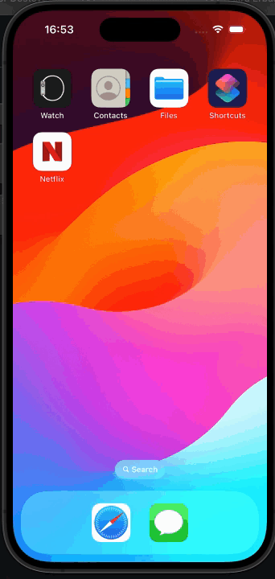
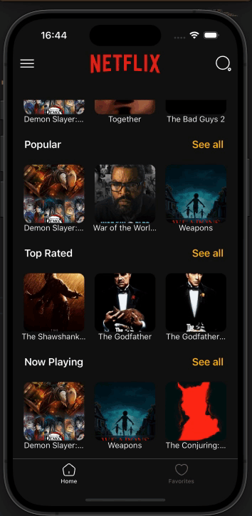

🎬 React Native Netflix Clone

A Netflix-inspired mobile application built with React Native.
This app provides a modern UI, navigation, state management with Redux, and splash screen functionality.

🚀 Features

📱 Cross-platform mobile app with React Native

🔄 Smooth navigation using React Navigation

🛠️ Global state management with Redux Toolkit

🎬 Movie/TV show listing (API ready with Axios)

🌙 Splash screen with react-native-bootsplash

🎨 Modern UI components with iconsax & react-native-svg

⚡ Optimized performance with hooks and react-use

📦 Dependencies

Main libraries used in this project:

React Native
 – Core framework

React Navigation
 – Navigation (bottom tabs + stack)

Redux Toolkit
 – State management

Axios
 – API requests

React Native BootSplash
 – Splash screen

React Native Safe Area Context
 – Safe area handling

React Native Screens
 – Optimized navigation screens

Iconsax React Native
 – Icon set

React Redux
 – Redux bindings for React

React Use
 – Useful React hooks

 ## Demo

## Demo
